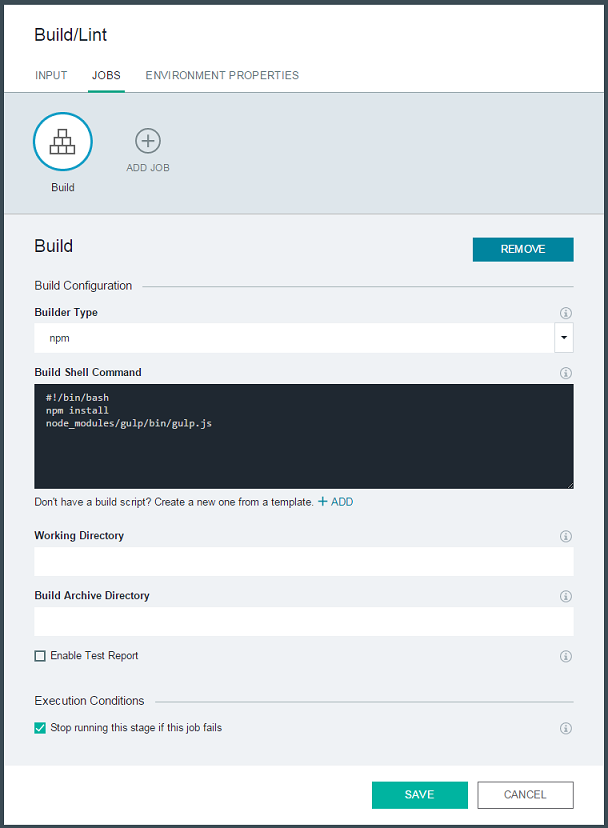

# Linting

###### Last updated: 01 September 2015

Linting is the process of performing static analysis on source code to flag patterns that might cause errors or other potential problems.

* [Getting Started](#howtostart)
* [Integrate linting into your project](#howtointegrate)
* [Configure the pipeline](#configurepipeline)


<a name='howtostart'></a>
##Getting Started

As an application progresses through the various stages of development, code quality becomes very important.  Testing your code to ensure that it meets functional requirements is a given, but it's also important to ensure that your code doesn't include any structural issues. Poorly structured code can impact the reliability and efficiency of your application and make your code harder to maintain long-term.  Linting is the key to finding and resolving these kinds of problems.  Linting tools can easily identify and correct common code mistakes, without having to run your app or write any test cases.

Linters are available for most coding languages and can typically be implemented several ways to suit your development needs.  IBM Open ToolChain offers integration with all of the following linters.  To get started, identify the linters that you would like to use from the following information.  These linting tools can be used independently or incorporated into your build process by using gulp files.

* **JSHint** is a linting tool that flags suspicious usage in programs that are written in JavaScript. The core project consists of the library itself and a CLI program distributed as a Node module.  To learn more about installing and configuring JSHINT, see the [JSHINT documentation](http://jshint.com/docs/)

* **JSCS** is a code style linter for programmatically enforcing your style guide. You can configure JSCS for your project in detail by using over 150 validation rules, including presets from popular style guides like jQuery, Airbnb, Google, and more.  To learn more about installing and configuring JSCS, see the [JSCS documentation](http://jscs.info/overview)

* **HTMLLint** is a linting tool for HTML5. It statically checks your documents for common errors so that you can identify problems in your code.  To learn more about installing and configuring HTMLLINT, see the [HTMLLINT documentation](https://github.com/htmllint/htmllint/wiki/htmllint-manual)

* **CSSLint** is a linting tool that points out problems with your CSS code. It does basic syntax checking and applies a set of rules to the code that looks for problematic patterns or signs of inefficiency. The rules are all pluggable, so you can easily write your own or omit ones that you don't want.  To learn more about installing and configuring CSSLint, see the [CSSLint documentation](https://github.com/CSSLint/csslint/wiki)


<a name='howtointegrate'></a>
##Integrate linting into your project

The linting tools that are described here can all be integrated seamlessly with your project by using the IBM Open ToolChain.  To accomplish this integration, we'll use [gulp](http://gulpjs.com/), a JavaScript task runner, to set up and configure the linters.  Then, we'll run them as a build stage in the DevOps Pipeline.

###Linting plug-ins for gulp:
* [JSHINT plug-in for gulp](https://www.npmjs.com/package/gulp-jshint)
* [JSCS plug-in for gulp](https://www.npmjs.com/package/gulp-jscs)
* [HTMLLINT plug-in for gulp](https://www.npmjs.com/package/gulp-htmllint)
* [CSSLINT plug-in for gulp](https://www.npmjs.com/package/gulp-csslint)

###Configure your linters in a gulpfile
1. Create a `gulpfile.js` file in the root of your project.  The following example can be used to get started.
```
  var gulp = require('gulp');
  
  gulp.task('default', function() {
    // place code for your default task here
  });
```
2. Next, use the following snippets to add one or more of the linting plug-ins to your gulpfile.

 **JSHINT**
 ```
  var jshint = require('gulp-jshint');
 
  gulp.task('lint-js', function() {
    return gulp.src(paths.js)
      .pipe(jshintrc())
      .pipe(jshint.reporter('default'));
  });
 ```
 Details:
 * `return gulp.src()` is used to defines the location of the files that should be linted
 * `.pipe(jshintrc())` defines a file named `.jshintrc` used to define what [linting options](http://jshint.com/docs/options/) are used
 * `.pipe(jshint.reporter('default'));` defines a [reporting value](https://www.npmjs.com/package/gulp-jshint#reporters).

 **JSCS**
 ```
  var jscs = require('gulp-jscs');
 
  gulp.task('lint-jscs', function () {
      return gulp.src(paths.js)
          .pipe(jscsrc());
  });
 ```
 Details:
 * `return gulp.src()` is used to defines the location of the files that should be linted
 * `.pipe(jscsrc());` defines a file named `.jscsrc` used to define what [linting options](http://jscs.info/overview#options) are used

 **HTMLLINT**
 ```
  htmllint = require('gulp-htmllint');
 
  gulp.task('lint-html', function() {
      return gulp.src(paths.html)
          .pipe(htmllintrc());
  });
 ```
  Details:
 * `return gulp.src()` is used to defines the location of the files that should be linted
 * `.pipe(htmllintrc());` defines a file named `.htmllintrc` used to define what [linting options](https://github.com/htmllint/htmllint/wiki/Options) are used

 **CSSLINT**
 ```
  var csslint = require('gulp-csslint');
 
  gulp.task('lint-csscss', function() {
    return gulp.src(paths.css)
      .pipe(csslintrc())
      .pipe(csslint.reporter());
  });
 ```
 Details:
 * `return gulp.src()` is used to defines the location of the files that should be linted
 * `.pipe(csslintrc());` defines a file named `.csslintrc` used to define what [linting options](https://github.com/CSSLint/csslint/wiki/Rules) are used
 * `.pipe(csslint.reporter());` defines a [reporting value](https://www.npmjs.com/package/gulp-csslint#using-reporters).

3. Next, we'll add a `paths` variable that we can use to define where the files are located that should be linted.
```
    paths = {
        html:['client/**/*.html','server/**/*.html'],
        css:['client/**/*.css','server/**/*.css'],
        js:['client/**/*.js','server/**/*.js','routes/**/*.js','!.meteor/**/*.js','app.js']
    },
```
The variables used here should corespond with what is defined in step 2 for `return gulp.src(paths.*)`, and the actual paths referenced within the brackets should identify the location of your JavaScript, HTML, or CSS code.
    
Your resulting gulpfile could resemble this snippet if you implement all of the linters.
```
/**
* Linting Gulpfile
*/

var gulp = require('gulp'),
//These paths need to be changed based on the location of the respective files on your application
    paths = {
        html:['client/**/*.html','server/**/*.html'],
        css:['client/**/*.css','server/**/*.css'],
        js:['client/**/*.js','server/**/*.js','routes/**/*.js','!.meteor/**/*.js','app.js']
    },
    jshint = require('gulp-jshint'),
    jscs = require('gulp-jscs'),
    htmllint = require('gulp-htmllint'),
    csslint = require('gulp-csslint');


/*
Gulp tasks for linting
*/

// Uses the .jshintrc file with some default configurations. Update the .jshintrc file based on the project requirements
gulp.task('lint-js', function () {
    return gulp.src(paths.js)
    .pipe(jshint())
    .pipe(jshint.reporter('default'));
});

// Uses the .jscsrc file with some default configurations. Update the .jscsrc file based on the project requirements
gulp.task('lint-jscs', function () {
    return gulp.src(paths.js)
    .pipe(jscs());
});

// Uses the .htmllintrc file with some default configurations. Update the .htmllintrc file based on the project requirements
gulp.task('lint-html', function () {
    return gulp.src(paths.html)
    .pipe(htmllint({
        htmllintrc: true
    }));
});

// Uses the .csslintrc file with some default configurations. Update the .csslintrc file based on the project requirements
gulp.task('lint-css', function () {
    return gulp.src(paths.css)
    .pipe(csslint('.csslintrc'))
    .pipe(csslint.reporter());
});
```

<a name='configurepipeline'></a>
###Configure the pipeline

With the linters configured, the next step is to set up the pipeline.
1. Create a new stage in your pipeline using the default input settings.
2. Add a new **Build** job to the stage using the **npm Builder Type**.
3. Modify the **Build Shell Command** as follows:
```
#!/bin/bash
npm install
node_modules/gulp/bin/gulp.js
```

3. Click **Save** to complete configuration of the stage.

The pipeline is now configured to perform linting on your code everytime you commit to your Git repository.

